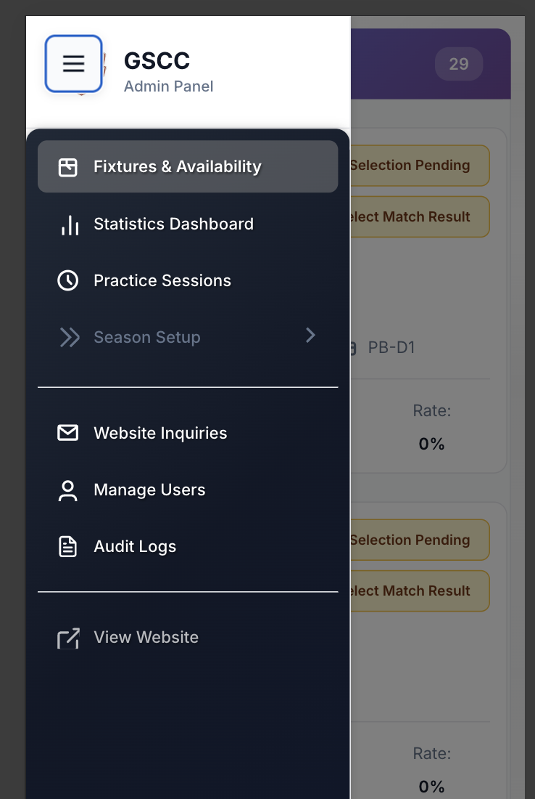
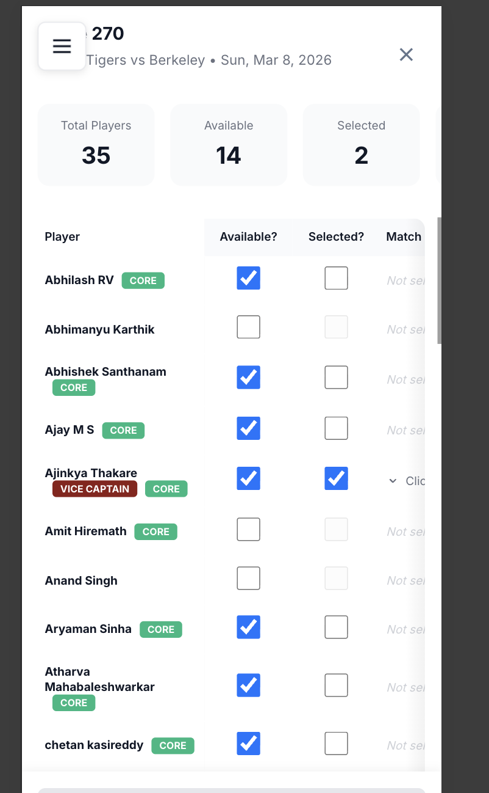
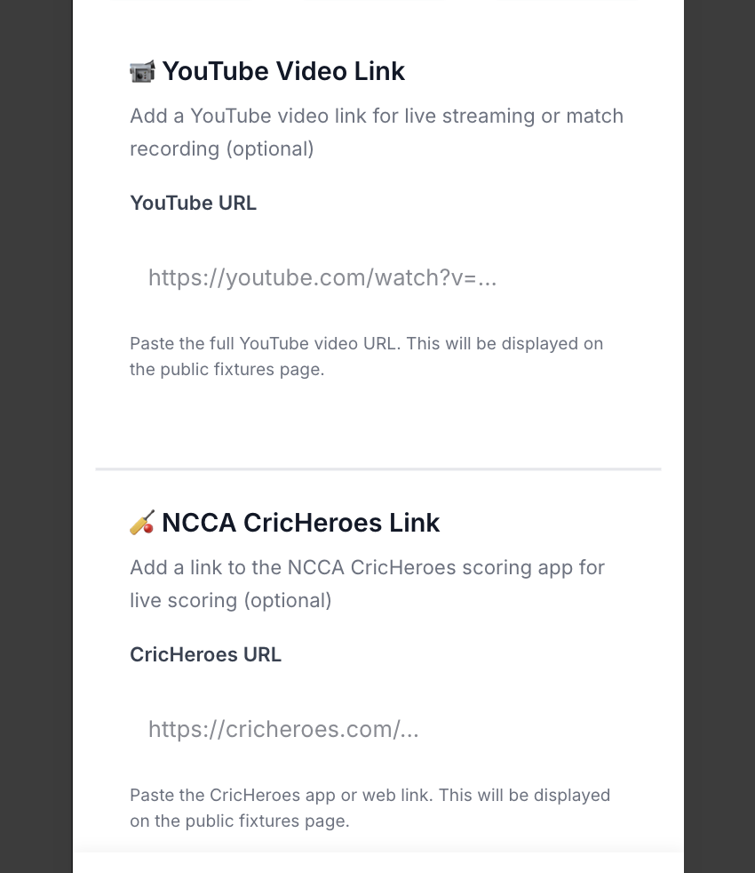
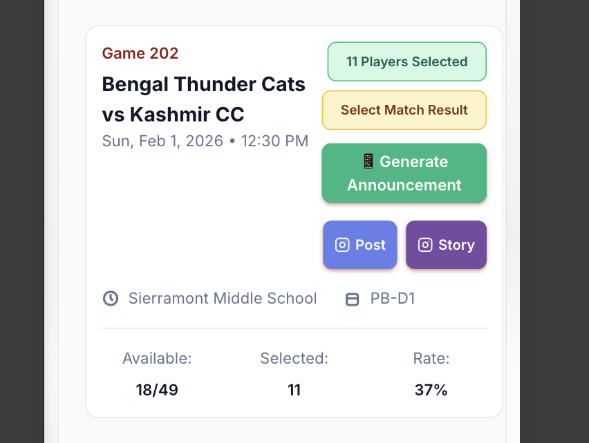
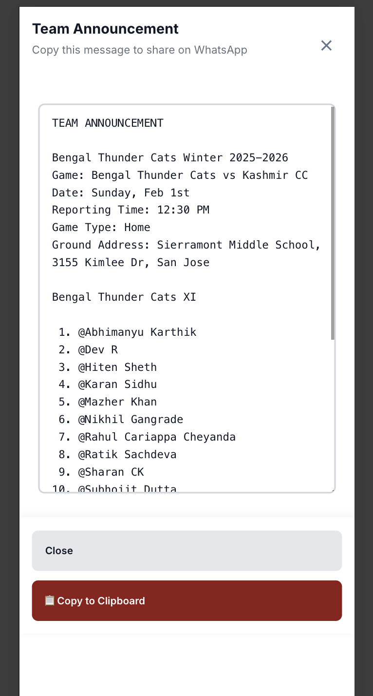
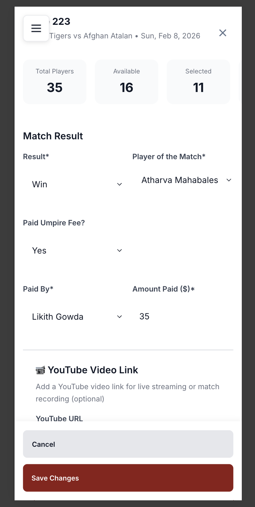

# Availability Portal - Quick Admin Guide

A visual guide for managing team selection and match announcements.

---

## 1. Access Fixtures & Availability

Open the admin menu and click **"Fixtures & Availability"**

---

## 2. Select Players (11 Required)

Click on a fixture to open the availability modal.

**Steps:**
1. Review who marked themselves **Available** (blue checkmark)
2. Check the **"Selected?"** box for 11 players
3. Click **"Save Changes"** (bottom of modal)

**Player Badges:**
- 🔴 **VICE CAPTAIN** - Team vice-captain
- 🟢 **CORE** - Core team member

---

## 3. Assign Match Duties (Optional)

Click **"Match Duties"** column for any selected player to assign:
- Warm Up, Water Assignment, Scoring, Team Kit, Ice
- Ground Set-up, Ground Cleaning, Video Broadcast

**Note:** Each duty can only be assigned to one player.

Click **"Save Changes"** when done.

---

## 4. Add Match Links (Optional)

Scroll down in the modal to add:

- **YouTube URL** - Live stream or match recording
- **CricHeroes URL** - Live scoring link

Click **"Save Changes"** after adding links.

---

## 5. Generate Team Announcement

Once 11 players are selected:

1. Click **"📱 Generate Announcement"** button
2. Review the announcement with all match details

3. Click **"📋 Copy to Clipboard"**
4. Paste in WhatsApp team group
5. **IMPORTANT:** Replace `@PlayerName` with actual WhatsApp contacts so players get notified

---

## 6. Record Match Results (After Match)

Open the fixture modal and scroll to **"Match Result"** section:

**Required:**
- **Result** - Win/Loss/Tie/No Result
- **Player of the Match** - Select from dropdown

**Optional (if applicable):**
- **Paid Umpire Fee?** - Yes/No
- **Paid By** - Which player paid
- **Amount Paid ($)** - Enter amount

Click **"Save Changes"** to record.

---

## 7. Social Media Sharing

**Instagram Post & Story buttons:**
- 📷 **Post** - Create Instagram post
- 📷 **Story** - Create Instagram story

⚠️ **Currently not working** - Use manual posting for now.

---

## ⚠️ Important Reminders

1. **ALWAYS click "Save Changes"** before closing any modal
2. **Replace @ mentions** with actual WhatsApp contacts when posting announcements
3. **Select exactly 11 players** for each match
4. **Record match results** after every game for accurate statistics

---

## Quick Workflow

**Before Match:**
→ Select 11 players → Assign duties → Add links → Save → Generate announcement → Post to WhatsApp

**After Match:**
→ Open fixture → Select result → Choose Player of Match → Enter umpire fees (if paid) → Save

